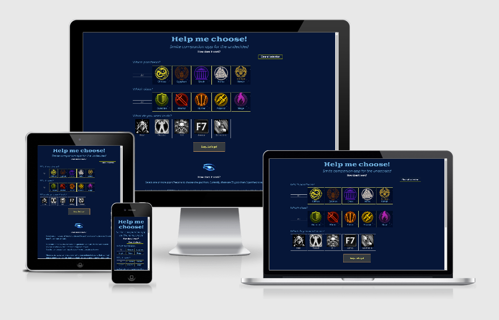

# Help me choose! 
## Smite companion app for the undecided

*Smite - Help me choose* is a small web app allowing undecided players to choose a god they will play in the next game. 
It includes a couple of different filters that will allow the user to narrow down the results to, optimally, one god. 

[View the *Smite - Help me choose* page](https://ardhanari.github.io/smitehelpmechoose/)

## Table of content
* [UX](#ux)
    * [Project Goals](#project-goals)
    * [User Goals](#user-goals)
    * [User Stories](#user-stories)
    * [Testing](#testing)
* [Design](#design)
* [Features](#features)
* [Deployment](#deployment)
* [Credits](#credits)

## UX
### Project Goals
The primary goal of S-HMC is to provide a simple and clean app to make the process of choosing the god easy and as quick as possible. It is intended for SMITE players, mostly those who are open to play multiple gods and own at least half of them (or preferably, had purchased God Pack). 
This project is planned to be light and concise, and contain only these functionalities and design choices that are relevant to the user. It is also intended as standalone mobile-first web app, accessible from all devices. 

### User Goals
To arrive at the result section with one god selected based on user’s choice, which they specify by ticking or unticking provided options in the filters section. 

### User Stories
#### SMITE player who has more than 500+ hours played and God Pack owned

They know their preferred gameplay style, the position in team fights and more or less know what every god is doing from experience. They may be a little bit bored with the gods they play regularly. The app is there to help them choose from the gods that fit their playstyle but may be not their first or even second choice. 

While using mainly class and function filters, they will also use pantheon filter, especially when completing certain quests in-game (like "play 3 games with a Chinese god"). 

#### SMITE player who has around half of the gods owned and wants to explore the next opportunities
Based on the results from this app, they will be able to decide better which god buy/rent next. Not all characters from the same class play the same and it’s sometimes hard or overwhelming to decide which one should be their next choice to try out. 

They will more likely rely more on the class filter, narrowing the results to a smaller group and then choosing these gods that function accordingly to the user’s selection. For example, a user plays only assassins and warriors and while they know the first class’ gods well, they may struggle with some of the gods from the latter (or expecting them to perform in a certain way). They will use this app to identify which gods from a certain class they want to look at first. 

#### SMITE player who is fairly new to the game and is looking for opportunities to expand
They own a small number of gods but they look for those that fit their preferred gameplay. They also can already afford to buy a new character. This app is there to allow them quick reconnaissance and help in understanding the differences between certain playstyles. 
They will most certainly skip pantheon and class filters (unless they have cultural preferences for example) and go straight to the function and specific function filters.  

#### Chaotic evil SMITE player

They don't know many gods but own most of them. They will go for the "annoy" function and figure it out on the fly during the game. 

While “annoy” function is quite subjective, gods assigned it were chosen based not only on my and my teammates' experience but also on several Reddit threads from Smite subreddit. 

### Testing
#### Testing scenarios

Following testing scenarios have been checked manually in different browsers (Google Chrome, Firefox, Internet Explorer) and on different devices (Windows and Android). 

1. User selects only specific function without changing the state of any default boxes.
    1. The result is easy to identify and understand.
    2. Clicking on main button for search re-rolls the result randomly.
    3. Clicking on the link to gamepedia opens the page with chosen god's abilities in a new tab
2. User clear all boxes and selects certain pantheon(s), class(es), function and specific function
    1. Option to clear all boxes is easy to find and understand
    2. "All" buttons make it easy to select all checkboxes in each filter
    3. Specific function filter follows up the main function filter in intuitive way
3. User tries to search for a god without selecting a function or specific function (if available)
    1. Makes sure alerts display correctly and indicate what action is necessary in order to start search
    2. In case of unselecting all pantheons or classes, the form displays short information suggesting to broaden the search by using more filters. 

## Design 
### Icons
All icons used in this project are the exact copy of these used in-game. Gods, pantheons and classes icons can be found on the gods' selection screen.

The images used for illustrating function filter come from in-game relics with the exception of “Annoy” function - this one is an F7 button, symbolic for not surrendering despite the odds in one's game.

The images are part of the filters along with their names to make using the site easy for both experienced and inexperienced SMITE players. 

### Colours
All colours follow both SMITE UI and Official SMITE Wiki. They were slightly adjusted to conform to contrast rules and to ensure that filters indicators are clear even with colour deficiency. 

## Features
### Existing Features

1. ReadMe File - holding basic information on the development of this project
2. JavaScript focused development 
3. Colour Scheme - following closely official game colours
4. Favicon 
5. Custom HTML and CSS - with a tiny addition of Boostrap
6. Icons - making understaning what the user is looking at easier at glance
7. Responsive design - mobile-first
8. UX elements 
9. Streamlined user flow
10. Accessibility
11. Remote repository on GitHub
13. Page hosted on Github Pages

### Planned Features 
1. Adding remaining pantheons to the filter
2. Adding additional optional conquest filter allowing players to search for gods fitting their preferences AND assigned conquest role
3. Adding more functions/specific functions to the filters allowing more combinations 
4. Additional, light CSS theme
5. Possibly, as a more tongue-in-cheek side of the project, adding Dog (gods with pets) and Bird (bird gods) filters

## Technologies Used
- [HTML](https://developer.mozilla.org/en-US/docs/Web/HTML) for the structure,
- [CSS](https://developer.mozilla.org/en-US/docs/Web/CSS) for styling,
- [Bootstrap](https://getbootstrap.com) for planned modals (not implemented in final version) and part of styling,
- [JavaScript](https://developer.mozilla.org/pl/docs/Web/JavaScript) for main functionality implementation,
- [JQuery](https://jquery.com) for easier DOM manipulation,
- [csv2json](https://www.csvjson.com/csv2json) to convert all data from .csv to array of objects,
- [Jigsaw](https://jigsaw.w3.org/css-validator/) and [JSHint](https://jshint.com) for testing integrity of code (CSS and JS respectively), 
- [Google Chrome](https://www.google.com/chrome/), [Firefox](https://www.mozilla.org/en-US/firefox/new/), [Internet Explorer](https://www.microsoft.com/en-us/download/internet-explorer.aspx) used for testing the app,
- [Google Chrome](https://www.google.com/chrome/)’s dev tools for live testing and monitoring and responsiveness testing,
- [Am I Responsive?](http://ami.responsivedesign.is/) for further responsiveness testing,
- [Figma](https://www.figma.com/) for creating crude mock-ups of functionality and design,
- [Git](https://git-scm.com) used for version control,
- [GitHub](https://github.com) and [GitHub Pages](https://pages.github.com) for hosting repository and website.

## Deployment
This project was developed using the Cloud9 IDE, committed to git and pushed to GitHub, using built-in Cloud9 functionality.

## Credits
### Content
Full gods list and icons of pantheons, classes, relics, crowd control, statistics and gods are from Official SMITE Wiki on https://smite.gamepedia.com/Smite_Wiki under CC BY-NC-SA 3.0 license. 

Gods functions and subfunctions, as well as .js file storing this data are created and assigned by the developer. 

### Acknowledgements

This project wouldn't be born without HiRez developers and creators who give life to SMITE and its community. 

It also wouldn't be nearly as functional as it is now, without Code Institute, its Slack community and my mentor Seun Owonikoko. 

Special thanks to Jakub Kołaciński who over 192 hours of playtime ago accepted my invitation to SMITE and hadn't rage quit yet :)

### Disclaimer 
This is intended for entertainment purposes. I’m not responsible for your bad KDA ratio ;)

Not affiliated with HiRez or SMITE. 

From fan to fans. 

Code Institute - Milestone Project 2 - Interactive Frontend Development
